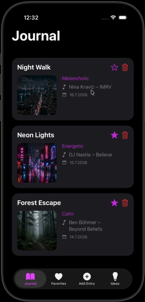
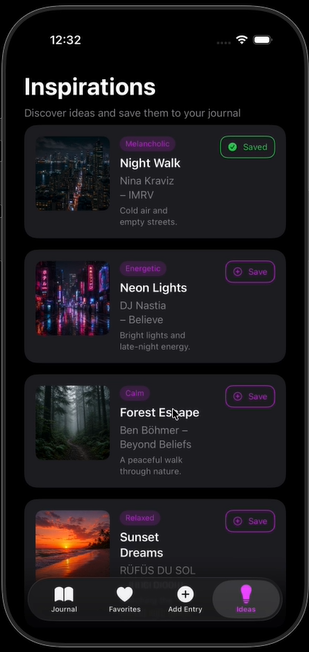

# MoodFlow

## Overview

MoodFlow is an iOS music journal application built with SwiftUI.

The idea behind MoodFlow is to organize music not only by artist or track name, but also by the **mood and emotional character of a track**.

The app was designed with DJs and music enthusiasts in mind. DJs can build a personal track collection and use moods, notes and atmosphere to rediscover music when preparing sets.

At the same time, MoodFlow can be used by any music listener as a personal music journal for tracks, emotions and memories.

The project combines a native iOS application with local Core Data storage and a PHP/MySQL backend for online inspiration data.

---

## Concept

MoodFlow focuses on the connection between **music and emotion**.

Tracks can be saved together with their mood, personal notes, date and image. For DJs, this can make it easier to find tracks with a particular atmosphere when preparing a set. For regular listeners, it works as a personal music diary and collection.

Examples of moods include **Melancholic**, **Energetic**, **Dreamy**, **Dark**, **Calm** and **Relaxed**.

---

## Tech Stack

- Swift / SwiftUI
- Xcode
- Core Data
- PHP
- MySQL
- HTTP / JSON
- AsyncImage

---

## Features

- Create personal music journal entries
- Add title, mood, artist, track, notes, date and image
- Organize tracks by mood and atmosphere
- Edit and delete saved entries
- Mark tracks as favorites
- Browse a dedicated Favorites view
- Discover inspiration tracks from an online database
- Save inspiration tracks to the local journal
- Store personal journal data locally using Core Data
- Load images for online inspiration tracks

---

## App Structure

MoodFlow contains four main areas:

- **Journal** – displays locally saved music entries
- **Favorites** – shows tracks marked as favorites
- **Add Entry** – creates a new personal journal entry
- **Ideas / Inspirations** – loads inspiration tracks from the online database

### Data Flow

```text
MySQL
  ↓
PHP
  ↓ JSON
TrackViewModel
  ↓
InspirationsView
  ↓ Save
Core Data (LocalTrack)
  ↓
Journal / Favorites
```

Personal journal data is stored locally using Core Data. Inspiration data is loaded from the PHP/MySQL backend and can be saved into the local journal.

---

## Screenshots

<p align="center">
  
  &nbsp;&nbsp;&nbsp;&nbsp;
  
</p>

---

## Demo

A short video demonstrates the main features and user flow of MoodFlow.

**[Watch MoodFlow Demo on YouTube](https://youtube.com/shorts/S6lWnSLOfik?feature=share)**

---

## Backend

The backend uses **PHP and MySQL** to provide inspiration track data to the iOS application as JSON.

Database credentials are intentionally not included in this public repository.

---

## Requirements

- macOS
- Xcode
- iOS Simulator or iPhone

---

## Notes

Personal journal entries, favorites and locally saved images are stored on the device using Core Data.

The **Inspirations** section requires an internet connection and access to the PHP/MySQL backend. If the original development server is unavailable, the local journal functionality can still be used independently.

---

## Author

**Ramiz Niftaliev**
